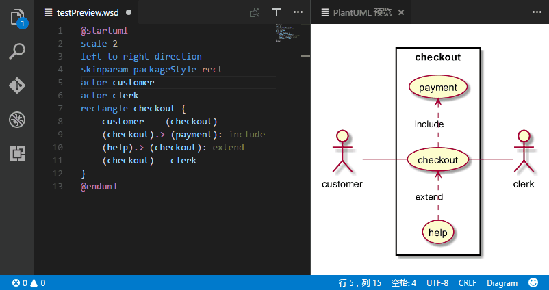
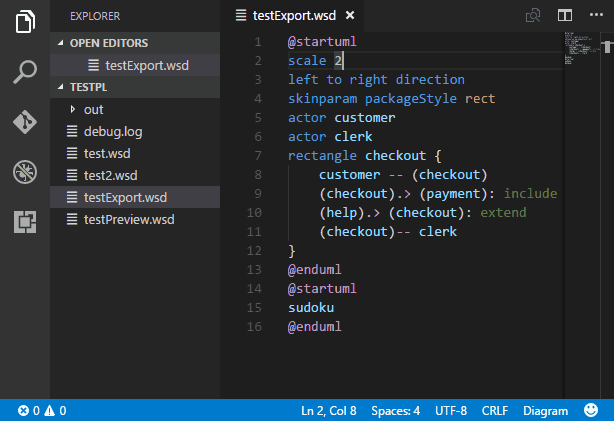
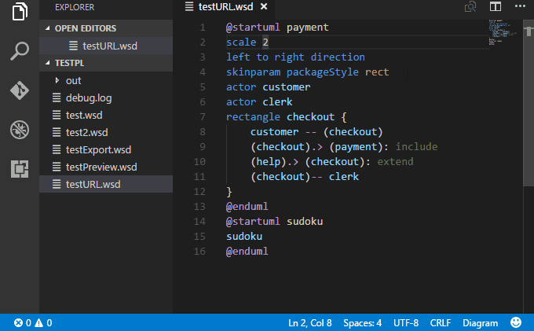
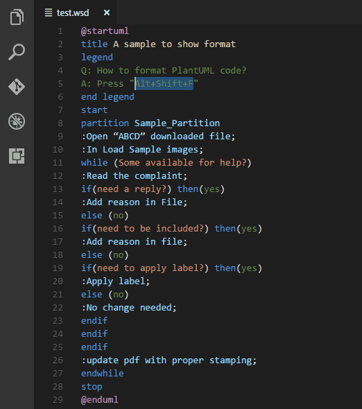
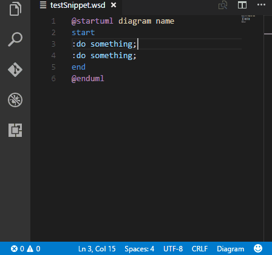
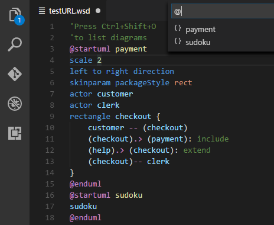
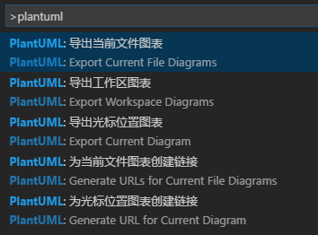

# NG PlantUML README

This fork provides much faster preview and exports via the use of [nailgun](https://github.com/martylamb/nailgun). The increased speed does, however, come at the cost of some configurability (missing configuration options are higlighted below).

This plugin provides rich support for PlantUML in VSCode, covers edit, preview, export and other aspects.

[Donate by Paypal](https://paypal.me/qjebbs "If you like this plugin, you can buy me a coffee. Feel free if you don't want to, since it's free!")
|
[Donate by AliPay](https://github.com/qjebbs/vscode-plantuml/blob/master/images/alipay.png?raw=true)
|
[PlantUML Document](http://plantuml.com/sitemap-language-specification)
## Features

- Preview Diagram, Press `Alt-D` to start PlantUML preview.
    - Auto update.
    - Zoom & scroll support.
    - Instant preview, if diagram's been exported.
    - From local or server.
- Export Diagrams
    - At cursor, in current file, in whole workspace, in workspace selected.
    - Concurrent export.
    - Generate URLs.
- Editing Supports
    - Format PlantUML code. **NEW!!** 
    - All type syntax highlight.
    - All type snippets.
    - Auto Include.
    - Symbol List support.

## Preview and Export Demos

Auto update:



zoom & scroll:


Export diagram:



Generate URLs:



## About Format



By default, format only indent code blocks and not change your line text. It's safe.

You can enable inline format with setting `plantuml.experimental.formatInLine`. Be careful, inline format is a very early experimental function, it may broke your code! Use it at your own risk!

## About Snippets



This plugin integrates all type diagram snippets. They are splitted into 9 sections:

- `diagram`: snippets for general diagrams elements.
- `activity`: snippets for activity diagrams.
- `class`: snippets for class diagrams.
- `component`: snippets for component diagrams.
- `state`: snippets for state diagrams.
- `usecase`: snippets for usecase diagrams.
- `sequence`: snippets for sequence diagrams.
- `ui`: snippets for salt diagrams.
- `egg`: snippets for some funny diagrams, like sudoku, earth.

For example, type `activity if else condition` or `acif` (short version) to trigge following snippet:

```
if (cond1?) then (val1)
    
else (val2)
    
endif
```

## About Symbol List (List diagrams of file)



Press `Ctrl+Shift+O` to list all diagrams in the file. You can name the diagram when diagram starts.

> @startuml diagram name<br/>
> sudoku<br/>
> @enduml

## About Auto Include

> Notice: People who don't use `!include` could ignore this chapter.


Auto Include liberates you from writing "!include path/to/include.wsd" everywhere. which is bother & hard to manage.

Suppose we have 2 files to include: `defines.wsd` and `myStyles.wsd`, and they are organized as follow:

```
├── includes
│   ├── defines.wsd
│   └── myStyles.wsd
├── sources
│   ├── sourceA.wsd
│   └── sourceB.wsd
├── out
```

In the past, we have to include them manually in every single diagram:

```
@startuml
    !include ../includes/defines.wsd
    !include ../includes/myStyles.wsd
    'contents goes here...
@enduml
```

Now, you can just replace them with a placehold `'autoinclude`, 

```
@startuml
    'autoinclude
    'contents goes here...
@enduml
```

and open workspace setting and config:

```
"plantuml.includes": [
    "includes"
]
```

### About integrated theme

Plugin shipped with a blue diagram theme, to enable it, config like:

```
"plantuml.includes": [
    "styles/blue"
]
```

## Multiple languages support. 

[Translations](https://github.com/qjebbs/vscode-plantuml/tree/develop/langs) are welcome.



## How to install

Launch VS Code Quick Open (Ctrl+P), paste the following command, and press enter.

`ext install plantuml`

## Requirements

Before you can use the plugin, it's necessary to have following installed:

* [Java][Java] : Platform for PlantUML running.
* [Graphviz][Graphviz] : PlantUML requires it to calculate positions in diagram.

[Java]: http://java.com/en/download/ "Download Java"
[Graphviz]: http://www.graphviz.org/Download..php "Download Graphviz"

> Plugin has integrated a copy of "plantuml.jar", you are good to go now. ~~But if you want to use your own jar (maybe a newer version, or with many dependent jars), specify the jar location with setting `plantuml.jar`.~~

> If you've installed java, but still prompts "java not installed", please add java bin path to `PATH` environment variable.

## Extension Settings

This extension contributes the following settings:

- ~~`plantuml.jar`: Alternate plantuml.jar location. Leave it blank to use integrated jar.~~
- `plantuml.fileExtensions`: File extensions that find to export. Especially in workspace settings, you may add your own extensions so as to export diagrams in source code files, like ".java".
- `plantuml.exportFormat`: format to export. default is not set, user may pick one format everytime exports. You can still set a format for it if you don't want to pick.
- `plantuml.exportInPlace`: export diagrams in the same folder as the host file with the same name as the host file.
- `plantuml.exportSubFolder`: export diagrams to a folder which has same name with host file (ignored if `plantuml.exportInPlace` is `true`).
- ~~`plantuml.exportConcurrency`: decides concurrency count when export multiple diagrams.~~
- `plantuml.exportOutDirName`: export workspace diagrams will be organized in a directory named with value specified here (ignored if `plantuml.exportInPlace` is `true`).
- `plantuml.previewAutoUpdate`: Dedecides if automatically update the preview window.
- `plantuml.previewFileType`: Preview file type, png or svg support. But svg preview cannot support sudoku, earth diagrams etc.
- `plantuml.previewFromUrlServer`: Use plantuml.urlServer to generate preview images.
- `plantuml.urlServer`: plantuml server to generate UML diagrams on-the-fly.
- `plantuml.urlFormat`: URL format. Leave it blank to pick format everytime you generate a URL.
- `plantuml.urlResult`: URL result type. Simple URL or ready for MarkDown use.
- `plantuml.includes`: Files or folders to include before preview/export diagrams. You don't have to write "!include path/to/include.wsd" for every single diagram any more.
- ~~`plantuml.commandArgs`: commandArgs allows you add command arguments to java command, such as `-DPLANTUML_LIMIT_SIZE=8192`.~~

## Known Issues

Please post and view issues on [GitHub][issues]

[issues]: https://github.com/jkeys089/vscode-plantuml/issues "Post issues"


## Thanks

- [koara-local](https://github.com/koara-local)
- [zhleonix](https://github.com/zhleonix/vscode-plantuml-ext/blob/r1.0.0/snippets/snippets.json)
- [shepherdwind](https://github.com/shepherdwind)
- [Martin Riedel](https://github.com/rado0x54)
-----------------------------------------------------------------------------------------------------------

**Enjoy!**
