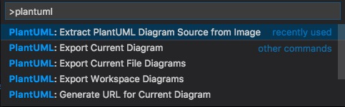
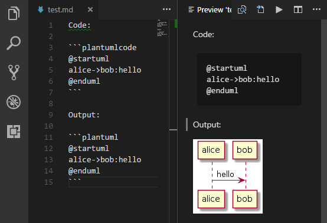

# PlantUML README

Rich PlantUML support for Visual Studio Code.

[](https://travis-ci.org/qjebbs/vscode-plantuml)

<!-- [Donate by Paypal](https://paypal.me/qjebbs "If you like this plugin, you can buy me a coffee. Feel free if you don't want to, since it's free!")
|
[Donate by AliPay](https://github.com/qjebbs/vscode-plantuml/blob/master/images/alipay.png?raw=true)
|
[PlantUML Document](http://plantuml.com/sitemap-language-specification) -->

## Notice

The server render is now very recommended by this extension, since it's much faster and much easier to setup, while the major weakness has been improved:

- Enables `POST` method, you can now render very-large diagrams
- The extension comes with a new `include processor`, you won't encounter include problems again.

To make sure you can benifit from this update, make sure your plantuml server enables `POST` support.

If not, like the official <https://www.plantuml.com/plantuml>, the extension falls back to use `GET`, and you may still encounter `414 URI Too Long` errors. Setup your own server is recommended.

[See also: About Render](#about-render)


## Features

- Preview Diagram, Press <kbd>Alt</kbd> + <kbd>D</kbd> to start PlantUML preview (<kbd>option</kbd> + <kbd>D</kbd> on MacOS).
    - Auto update.
    - Zoom & scroll support.
    - Multi-Page Diagram support.
    - Instant preview, if diagram's been exported.
    - From local or server.
    - Snap to Border
- Export Diagrams
    - At cursor, in current file, in whole workspace, in workspace selected.
    - Concurrent export.
    - Generate URLs.
    - Multi-Page Diagram support.
    - From local or server.
    - Image map (cmapx) support.
- Editing Supports
    - Format PlantUML code. (**Deprecated**)
    - All type syntax highlight.
    - All type snippets.
    - Basic auto completion & macro signature support
    - Symbol List support.
- Others
    - Multi-root Workspace Support.
    - MarkDown integrating support. [View Demo](#markdown-integrating)
    - Extracting source from images support.

> Notice: If you use customize `plantuml.jar`, please update to the latest version to enable `Multi-Page Diagram support`. (Later than `V1.2017.15`)

>  Format PlantUML code is **Deprecated**. Don't depend on it, use it only when it works right. I had force disable it in auto-format cases (format on save).

## Supported Formats

`*.wsd`, `*.pu`, `*.puml`, `*.plantuml`, `*.iuml`

## How to install

Launch VS Code Quick Open (Ctrl+P), paste the following command, and press enter.

`ext install plantuml`

## Requirements

Depend on which render you choose, plugin has diffrerent requirements.

### Requirements for PlantUMLServer render

A plantuml server.  See [Use PlantUML Server as render](#use-plantuml-server-as-render).

### Requirements for Local render

It's necessary to have following installed:

- [Java][Java] : Platform for PlantUML running.
- [Graphviz][Graphviz] : PlantUML requires it to calculate positions in diagram.

[Java]: http://java.com/en/download/ "Download Java"
[Graphviz]: http://www.graphviz.org/download/ "Download Graphviz"

#### Quick Install for Mac

```sh
brew install --cask temurin
brew install graphviz
```

#### Quick Install for Windows

The plugin has an integrated copy of plantuml.jar and GraphViz, so you are normally good to go. 
But if you want to use your own jar or a different version of GraphViz (maybe a newer version, or with many dependent jars):

- download the latest `plantuml.jar` or install it using chocolatey (see below). 
- specify the jar location with the extension setting `plantuml.jar`.
- specify the GraphViz installation by defining the Windows environment variable `GRAPHVIZ_DOT`, e.g., `c:\program files\graphviz\bin\dot.exe` if you installed plantuml with chocolatey, which automatically installs the latest GraphViz as a dependency.

##### Choco install
For windows users, [majkinetor](https://github.com/majkinetor) introduced a way to install plantuml and its dependencies easily. 
Run `cmd.exe` as Administrator, and run two commands as follows (the first command is not needed and will fail if you already have chocolatey installed).

```cmd
@"%SystemRoot%\System32\WindowsPowerShell\v1.0\powershell.exe" -NoProfile -ExecutionPolicy Bypass -Command "iex ((New-Object System.Net.WebClient).DownloadString('https://chocolatey.org/install.ps1'))" && SET "PATH=%PATH%;%ALLUSERSPROFILE%\chocolatey\bin"

choco install plantuml
```

> If you've installed java, but still prompts "java not installed", please add java bin path to `PATH` environment variable.

## Typical Files Organization

- Default extension settings works for independent Plantuml projects.
- If Plantuml files are only part of your project (as documetation), use `plantuml.diagramsRoot` and `plantuml.exportOutDir` to setting up the organization, for example:

```json
"plantuml.diagramsRoot": "docs/diagrams/src",
"plantuml.exportOutDir": "docs/diagrams/out"
```

You'll get export results like:

```
Project Folder/
  docs/
    diagrams/
      src/
        architecture_overview.wsd
      out/
        architecture_overview/
          architecture_overview.png
  ...rest_of_your_project_folders/
  ...rest_of_your_project_files 
```

## Include Files Search Logic

Latest version has changed the include files search logic once again.
It is possible to configure includepaths now in settings.json.

The new search order is as follows:
1. The folder of the rendered file
2. The `includepaths` as configured in settings.json
```json
"plantuml.includepaths": ["docs/diagrams/style","docs/diagrams/src"],
```
3. The `diagramsRoot`

The setting `includeSearch` is not needed anymore, since the folder of the plantuml file and the `diagramsRoot` are always both in the include path.

To new projects, it's recommended not to rely on `diagramsRoot` and configure all required `includepaths` explicitly.

> Thanks [anotherandi](https://github.com/anotherandi) for the brilliant idea and implementation!

## Preview Demos


Preview page provides various zoom/pan actions and snap feature:

- Zoom operations (since version 2.7.0): 
    - Zoom to select area
    - Pinch to zoom (TouchPad)
    - Click to zoom in, alt + click to zoom out
    - Ctrl + mouse scroll to zoom in/out
    - Middle mouse button click to toggle zoom
    - Zoom in / zoom out / toggle buttons of the controls bar.
- Pan operations (since version 2.7.0):
    - Right mouse button drag
    - Two-finger move to pan (TouchPad)
    - Mouse scroll
- Snap to border (since v2.8.0):
    - Scroll to most bottom/right/top/left, preview will snap to that border. 
    > e.g. Snap to Bottom is useful while writing long activity diagrams, which helps you keep focus in the latest part in the bottom.  


Auto update:


zoom & scroll:


Multi-Page View:


## Export Demos

Export diagram:


## Generate URLs


## Extract Diagram Source



## About Format


> PlantUML formatter is disabled (since v2.8.3) if `editor.formatOnSave` is on. 
Because the formatter is not reliable enough according to user feedbacks.

## About Snippets


This plugin integrates all type diagram snippets. They are splitted into 9 sections:

- `diagram`: snippets for general diagrams elements.
- `activity`: snippets for activity diagrams.
- `class`: snippets for class diagrams.
- `component`: snippets for component diagrams.
- `state`: snippets for state diagrams.
- `usecase`: snippets for usecase diagrams.
- `sequence`: snippets for sequence diagrams.
- `ui`: snippets for salt diagrams.
- `egg`: snippets for some funny diagrams, like sudoku, earth.

For exsample, type `acife` (short version) to trigge following snippet (`activity➤if・else`):

```plantumlcode
if (cond1?) then (val1)

else (val2)

endif
```

## About Symbol List (List diagrams of file)


Press `Ctrl+Shift+O` to list all diagrams in the file. You can name the diagram when diagram starts.

> @startuml diagram name
> sudoku
> @enduml

## About Render

Plugin supports two renders: `Local` and `PlantUMLServer`.

Local is the default and traditional way. If you care more about export speed, you should try PlantUMLServer.

```text
Local: 6 documents, 9 digrams, 14 files exported in 24.149 seconds
PlantUMLServer: 6 documents, 9 digrams, 14 files exported in 1.564 seconds
```

## Advantages and Disadvantages of PlantUMLServer Render

Advantages:

- 15X times faster export and much quicker preview response.
- Don't have to set local enviroments if you have a server in your team.
- You don't need `plantuml.exportConcurrency`, because it's unlimited in concurrency.

Disadvantages:

- ~~Cannot render very-large diagrams (414 URI Too Long).~~
- ~~Cannot render diagrams with `!include` in it.~~
- Less format support: png, svg, txt.
- Some settings are not applicable: `plantuml.jar`, `plantuml.commandArgs`, `plantuml.jarArgs`.

## Use PlantUML Server as Render


> To render very-large diagrams with include support, please make sure your plantuml server enables `POST` support.
>
> If not, like the official <https://www.plantuml.com/plantuml>, the extension falls back to use `GET`, and you may still encounter `414 URI Too Long` errors.
>
> Setup your own server is recommended.

- You may already have a PlantUML server in your team, find the server address, like: `http://192.168.1.100:8080`.

- If don't have one, set up [following the instructions](https://github.com/plantuml/plantuml-server), run with Docker is recommended. Find the server address, like: `http://localhost:8080`, or `http://192.168.1.100:8080` which is ready for sharing to your team.

- Another option for running a PlantUML server on your local machine is to use the built in picowebserver, which can be as simple as running `java -jar plantuml.jar -picoweb`,  read more here: <https://plantuml.com/picoweb>

- Open user setting, and configure like:

```text
"plantuml.server": "http://192.168.1.100:8080",
"plantuml.render": "PlantUMLServer",
```

## Multiple languages support

Translations are welcome. [lang.nls.json](https://github.com/qjebbs/vscode-plantuml/blob/master/langs/lang.nls.json), [package.nls.json](https://github.com/qjebbs/vscode-plantuml/blob/master/package.nls.json)


## MarkDown integrating



`@startuml / @enduml` is still recommended, so that PlantUML code in Markdown can be managed by other function of this plugin.

## Extension Settings

This extension contributes the following settings.

Render Select:

- `plantuml.render`: Select diagram render for both export and preview.

PlantUMLServer Render Settings:

- `plantuml.server`: PlantUML server to generate UML diagrams on-the-fly.

Local Render Settings:

- `plantuml.java`: Java executable location.
- `plantuml.commandArgs`: commandArgs allows you add command arguments to java command, such as `-DPLANTUML_LIMIT_SIZE=8192`.
- `plantuml.jar`: Alternate plantuml.jar location. Leave it blank to use integrated jar.
- `plantuml.jarArgs`: jarArgs allows you add arguments to plantuml.jar, such as `-config plantuml.config`.
- `plantuml.includepaths`: Specifies the include paths besides source folder and the `diagramsRoot`.

Export Settings:

- `plantuml.diagramsRoot`: Specifies where all diagram files located (relative to workspace folder).
- `plantuml.exportOutDir`: Exported workspace diagrams will be organized in this directory  (relative path to workspace folder).
- `plantuml.fileExtensions`: File extensions that find to export. Especially in workspace settings, you may add your own extensions so as to export diagrams in source code files, like ".java".
- `plantuml.exportFormat`: format to export. default is not set, user may pick one format everytime exports. You can still set a format for it if you don't want to pick.
- `plantuml.exportSubFolder`: export diagrams to a folder which has same name with host file.
-	`plantuml.exportIncludeFolderHeirarchy`: include folder heiracrchy between the root and the source diagram in the exported file path.
- `plantuml.exportConcurrency`: decides concurrency count when export multiple diagrams.
- `plantuml.exportMapFile`: Determine whether export image map (.cmapx) file when export.

Preview Settings:

- `plantuml.previewAutoUpdate`: Dedecides if automatically update the preview window.

Other Settings:

- `plantuml.urlFormat`: URL format. Leave it blank to pick format everytime you generate a URL.
- `plantuml.urlResult`: URL result type. Simple URL or ready for MarkDown use.
- `plantuml.lintDiagramNoName`: Decides if it should lint when diagram is unmaned.

## Known Issues

Please post and view issues on [GitHub][issues]

[issues]: https://github.com/qjebbs/vscode-plantuml/issues "Post issues"

## Thanks

- [Kohei Arao](https://github.com/koara-local)
- [zhleonix](https://github.com/zhleonix/vscode-plantuml-ext/blob/r1.0.0/snippets/snippets.json)
- [Eward Song](https://github.com/shepherdwind)
- [Martin Riedel](https://github.com/rado0x54)

## Translators

- Japanese: [Kohei Arao](https://github.com/koara-local), [kannkyo](https://github.com/kannkyo)
- Tranditional Chinese: [Alan Tsai](https://github.com/alantsai)
- German: [Fabian F.](https://github.com/fur6y)
- French: [Zepmanbc](https://github.com/Zepmanbc), [FlorianKempenich](https://github.com/FlorianKempenich)
- Danish: [Mikkel O. Laursen](https://github.com/mikkel-ol)

## Donators

Thanks for your encouragements!

> Claus Appel, 三島木​一磨, 富吉​佑季, 黒田悦成, Jared Birdsall, Suleyman Cabir Ciplak, Malcolm Learner, Сысоев Максим, Gokan Kenichi, anb0s, Lawrence Yarian, Ahmad Ragab, 山田​暁通

-----------------------------------------------------------------------------------------------------------

**Enjoy!**
