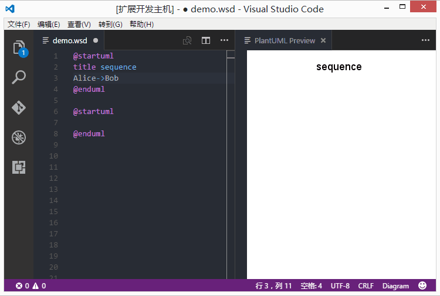

# PlantUML README

This is a plugin that preview and export PlantUML diagrams in VSCode.

By default, it binds the `Alt-D` key (Preview diagram) and registers export & preview commands on the Command Palette. 
Place your cursor in your diagram and trigger the command.

The plugin manages multiple diagrams in one file, and support concurrency export when exports them.

To export diagrams, go to Command Palette, find and execute command:
- `PlantUML: Export Current Diagram` 
- `PlantUML: Export Current File Diagrams`.
- `PlantUML: Export Workspace Diagrams`.

To Generate URL for diagrams on-the-fly, find and execute command:
- `PlantUML: Generate URL for Current Diagram` 
- `PlantUML: Generate URLs for Current File Diagrams`.

Default, it generates markdown image snippets. You can change to simple url through `plantuml.urlResult`

Press `Ctrl+Shift+O` to list all diagrams in the file. You can name the diagram when diagram starts.

> @startuml diagram_name 
> sudoku 
> @enduml

## Features

- Preview and auto update.
- Export diagram at cursor, or diagrams in current file or whole workspace.
- Concurrent export.
- Generate compressed URLs.
- New syntax file, support all diagram types.
- Snippets for activity diagrams and `Eggs`.

## How to install

Launch VS Code Quick Open (Ctrl+P), paste the following command, and press enter.

`ext install plantuml`

## Requirements

Before you can use the plugin, it's necessary to have following installed:

* [Java][Java] : Platform for PlantUML running.
* [Graphviz][Graphviz] : PlantUML requires it to calculate positions in diagram.
* [PlantUML][PlantUML] : Download and place it in extension root folder.

[Java]: http://java.com/en/download/ "Download Java"
[Graphviz]: http://www.graphviz.org/Download..php "Download Graphviz"
[PlantUML]: http://plantuml.com/download "Download PlantUML"

> If you've installed java, but still prompts "java not installed", please add java bin path to `PATH` environment variable.

## Extension Settings

This extension contributes the following settings:

- `plantuml.exportFormat`: format to export. default is not set, user may pick one format everytime exports. You can still set a format for it if you don't want to pick.
- `plantuml.exportSubFolder`: export diagrams to a folder which has same name with host file.
- `plantuml.exportConcurrency`: decides concurrency count when export multiple diagrams.
- `plantuml.exportOutDirName`: export workspace diagrams will be organized in a directory named with value specified here.
- `plantuml.autoUpdatePreview`: edecides if automatically update the preview window.
- `plantuml.urlServer`: plantuml server to generate UML diagrams on-the-fly.
- `plantuml.urlFormat`: URL format. Leave it blank to pick format everytime you generate a URL.
- `plantuml.urlResult`: URL result type. Simple URL or ready for MarkDown use.

## Known Issues

Please post and view issues on [GitHub][issues]

[issues]: https://github.com/qjebbs/vscode-plantuml/issues "Post issues"

-----------------------------------------------------------------------------------------------------------

**Enjoy!**